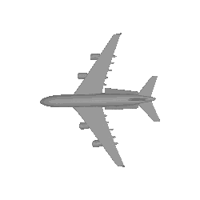
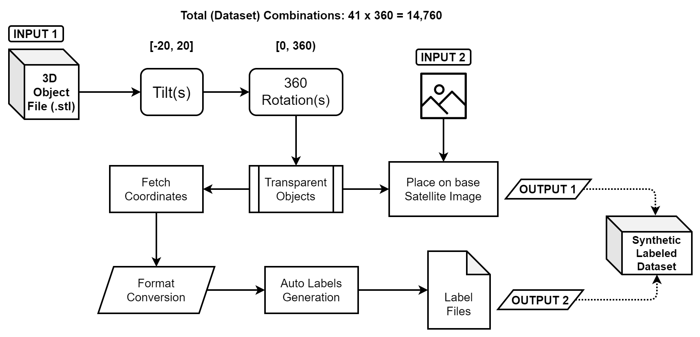
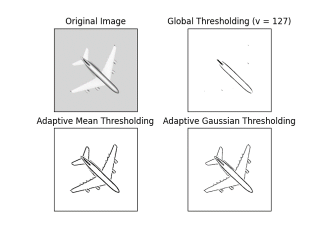
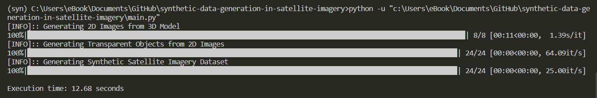

# Synthetic Data Generation in Satellite Imagery (Pipeline)

## Creating a Conda Environment
```
conda create -n synthetic_data_generation python=3.9
```
## Installation
```
pip install -r requirements.txt
```
## Usage
```
python main.py
```

## Synthetic 3D Objects to Dataset Generation

- Introduction
- 3D .STL Image 
- Transform Angle / Rotation
- Overlay Images – Synthetics Data

## Data augmentation

- Overcome challenge of limited data
- Diversity of the training data
- Smooth out the machine learning model
- Reduce the overfitting of data
- Help improve the performance and results


## 3D STL Image Animation

<!--  -->


## WorkFlow Diagram


## Overlay Images - Synthetic Data Generation

### Convert 3D objects to 2D images with rotation and tilt
.png)
.png)
.png)
.png)
.png)
.png)

<!-- 


 -->


### 2D Image to Tansparent Objects Generation

<br />

## Base as a background image from satellite imagery

<!--  -->

## Overlay Images Overview
.png)
.png)
.png)
.png)
.png)
.png)
.png)
.png)

## Adding overlay images to background satellite imagery
.png)
.png)
.png)
.png)
<!-- 


 -->

## Execution time on local machine



